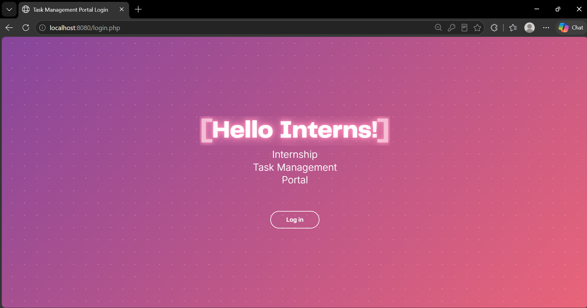
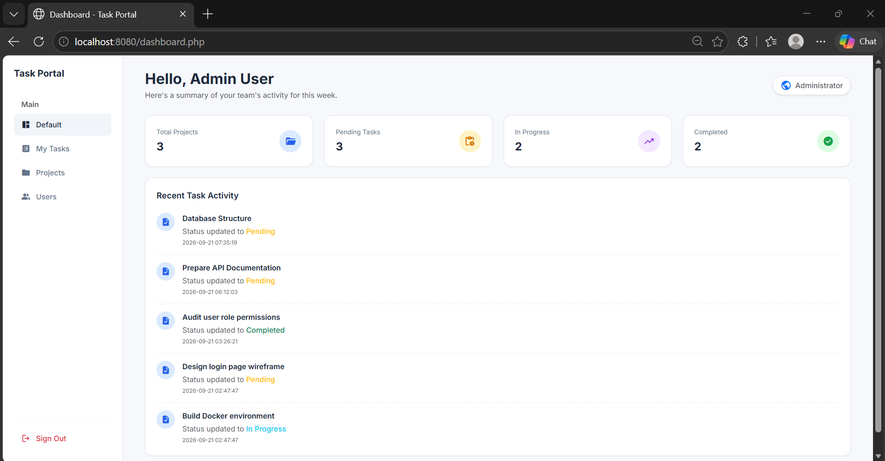
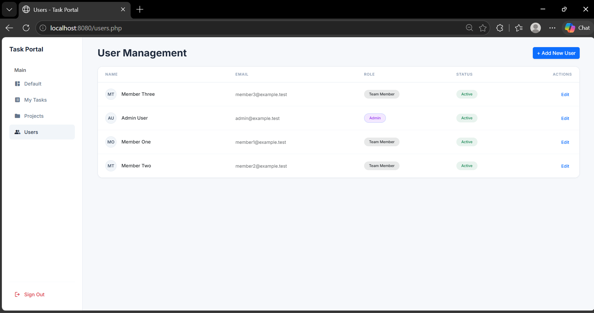
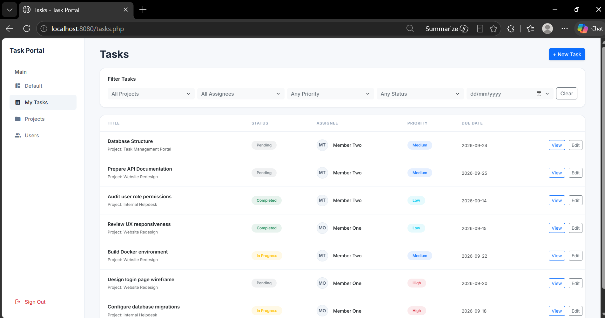
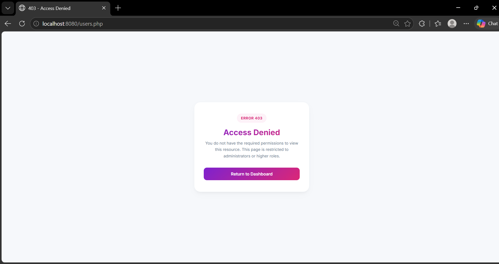

# Task Portal

A lightweight, Dockerized task management web application built with PHP 8.2 and MySQL 8.0.

Task Portal provides a centralized workspace for administrators and team members to manage projects, assign tasks, collaborate through task comments, and track project progress through an interactive dashboard.

---

# Table of Contents

1. Project Overview
2. Features
3. Technology Stack
4. System Requirements
5. Installation Guide
6. Environment Configuration
7. Running the Application
8. Database Initialization & Reset
9. Sample Credentials
10. User Roles
11. Project Structure
12. Basic Usage Guide
13. Screenshots
14. Security Features
15. Testing Checklist
16. Troubleshooting
17. Future Improvements
18. Author

---

# Project Overview

## Objective

Task Portal was developed to provide a centralized platform for:

- Managing projects
- Assigning tasks
- Tracking task progress
- Supporting collaboration through task comments
- Monitoring work through dashboard reporting

The system was developed as part of an internship software development project.

---

# Features

## Authentication & Access Control

- Session-based authentication
- Session regeneration upon login
- Role-Based Access Control (RBAC)
- Protected routes
- Account activation and deactivation

## User Management

Administrator can:

- Create users
- Edit users
- Assign roles
- Activate and deactivate accounts

## Project Management

Administrator can:

- Create projects
- Edit projects
- Assign project members
- Manage Project Status
- Delete Projects

> Note: Deleting a project will also remove all tasks and comments associated with that project through database cascade rules.

## Task Management

Users can:

- Create tasks
- Assign tasks
- Edit tasks
- Update task status
- Set due dates
- Set priorities

Task Statuses:

- Pending
- In Progress
- Completed

Task Priorities:

- Low
- Medium
- High

## Task Collaboration

Users can:

- Add comments
- View comment history
- Record task updates
- Track activity discussions

## Dashboard

Provides:

- Total Projects
- Pending Tasks
- In Progress Tasks
- Completed Tasks
- Recent Activity

## Task Filtering

Tasks can be filtered by:

- Project
- Assignee
- Priority
- Status
- Due Date

---

# Technology Stack

## Backend

- PHP 8.2
- Apache
- PDO

## Database

- MySQL 8.0

## Frontend

- HTML5
- CSS3
- Bootstrap 5
- JavaScript

## Infrastructure

- Docker
- Docker Compose

---

# System Requirements

Required software:

- Docker Desktop
- Git
- Modern Web Browser

Verify installation:

```bash
docker --version
docker compose version
git --version
```

---

# Installation Guide

## Clone Repository

```bash
git clone <repository-url>
cd task_portal
```

## Build and Start Containers

```bash
docker compose up --build
```

## Access Application

Open:

```text
http://localhost:8080
```

## Stop Application

```bash
docker compose down
```

---

# Environment Configuration

Verify `.env` configuration:

```env
DB_HOST=db
DB_NAME=task_portal
DB_USER=root
DB_PASS=root_password
```

---

# Running the Application

Start Docker containers:

```bash
docker compose up --build
```

Open browser:

```text
http://localhost:8080
```

Login using one of the sample accounts below.

---

# Database Initialization & Reset

Database schema and sample records are located in:

```text
database/init.sql
```

To recreate the database:

```bash
docker compose down -v
docker compose up --build
```

---

# Sample Credentials

## Administrator

```text
Email: admin@example.test
Password: InternDemo!2026
```

Permissions:

- User Management
- Project Management
- Task Management
- Dashboard Monitoring

---

## Team Member

```text
Email: member1@example.test
Password: InternDemo!2026
```

Permissions:

- View Assigned Projects
- View Assigned Tasks
- Update Task Status
- Add Comments

---

# User Roles

## Administrator

Responsible for:

- Managing users
- Managing projects
- Assigning project members
- Creating tasks
- Monitoring progress

## Team Member

Responsible for:

- Viewing assigned projects
- Viewing assigned tasks
- Updating task status
- Participating in task discussions

---

# Project Structure

```text
task_portal/
│
├── database/
│   └── init.sql
│
├── public/
│   ├── dashboard.php
│   ├── login.php
│   ├── logout.php
│   ├── users.php
│   ├── projects.php
│   ├── tasks.php
│   └── ...
│
├── src/
│   ├── config/
│   ├── helpers/
│   └── models/
│
├── screenshots/
│
├── docker-compose.yml
├── Dockerfile
├── .env
└── README.md
```

---

# Basic Usage Guide

## Administrator Workflow

1. Login.
2. Create a project.
3. Assign members.
4. Create tasks.
5. Assign tasks.
6. Monitor dashboard.

## Team Member Workflow

1. Login.
2. View assigned tasks.
3. Update task status.
4. Add comments.
5. Complete assigned work.

---

# Screenshots

## Login Page

Authentication portal.

```text
screenshots/login.png
```


---

## Dashboard

Project metrics and activity overview.

```text
screenshots/dashboard.png
```



---

## User Management

Administrator user management interface.

```text
screenshots/user_management.png
```



---

## Task Filtering

Multi-parameter task filtering.

```text
screenshots/task_filtering.png
```



---

## Access Control

403 Access Denied page.

```text
screenshots/403_accessdenied.png
```



---

# Security Features

Implemented security controls:

- Password Hashing
- Password Verification
- Session Authentication
- Session Regeneration
- Role-Based Access Control
- CSRF Protection
- PDO Prepared Statements
- Input Validation
- Output Sanitization

---

# Testing Checklist

Verified modules:

- Authentication
- Access Control
- User Management
- Project Management
- Task Management
- Task Comments
- Dashboard
- Task Filtering
- Security Controls

---

# Troubleshooting

## Port 8080 Already In Use

Stop services such as:

- XAMPP
- WAMP
- IIS

Then restart Docker.

---

## Port 3306 Already In Use

Stop local MySQL services before starting Docker.

---

## Docker Not Running

Ensure Docker Desktop is launched and displays:

```text
Engine Running
```

---

## Database Connection Error

Verify:

```env
DB_HOST=db
DB_NAME=task_portal
DB_USER=root
DB_PASS=root_password
```

Then restart containers.

---

# Known Limitatations

## 1. Local Session Storage

User sessions are currently stored within the application container.

Impact: if the app is deployed across multiple servers, session data would not be shared between instances.

Currently suitable for internship projects, small teams and single-server deployments

## 2. No Notification System (Email)

The system does not send an automated email notifications to the users.

Impact: Users manually need to check the new tasks, or task updates and project changes.

## 3. Does not support file attachment

Impact: users unable to attach Images, PDFs or any technical documentation related to the project.

## 4. Limited reporting and analytic

Current dashboard provides basic statistics.

Impact: Managers are not able to generate a detailed reports, especially when it comes to monthly productivity summaries, user workload reports and project completion trends.

## 5. No Audit Loggign

Users activity aren't permanently recorded

Impact: admins unable to track who edited a task, modified project or changed user roles.

## 6. No Real-Time Updates

Impact: Users may not immediately see new comments, any updates regarding their tasks or changes in status.

## 7. Mobiles are not optimized

The system is still responsive but not optimized specifically for mobile devices.
 
Impact: Users may not immediately see new comments, any updates regarding their tasks or changes in status.

---

# Future Improvements

Potential future enhancements:

- Implement centralized session storage (Example: Redis or Memcached)
- Email Notifications services (Example: SMTP, SendGrid, Microsoft 365 SMTP etc.)
- File Attachments on tasks/projects
- Reporting dashboard/export to excel/ export to pdf/ charts
- Implement activity log module for any changes
- Utilize AJAX, WebSockets or Server-Sent Events (SSE) for real-time updates
- Develop Mobile-first layouts or Improved responsive navigation

---

# Author

Developed as part of an Internship Software Development Project using:

- PHP 8.2
- MySQL 8.0
- Apache
- Docker
- Bootstrap 5